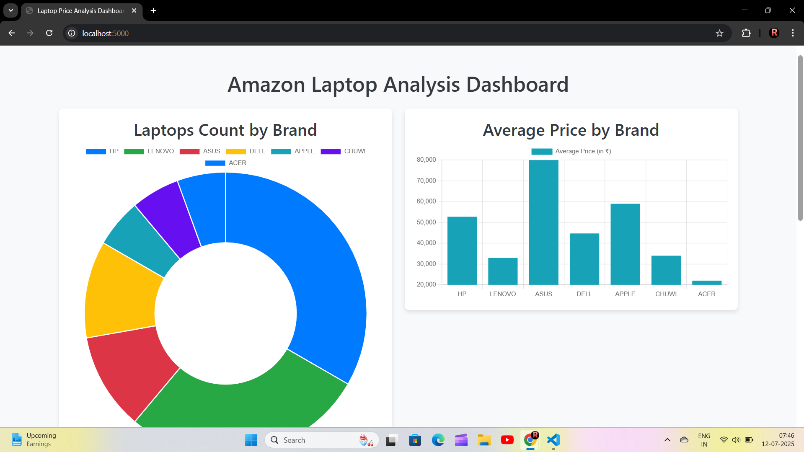

# Amazon Laptop Analysis Dashboard

A web dashboard that scrapes laptop data from Amazon.in, cleans it, and visualizes key metrics like brand distribution, average price, and user ratings.

 


## Features
- **Web Scraping**: Scrapes real-time laptop data (Name, Price, Rating) from Amazon using `requests` and `BeautifulSoup`.
- **Data Cleaning**: Cleans and processes the raw data using the `pandas` library.
- **Database Storage**: Stores the cleaned data in an `SQLite` database.
- **Flask Backend**: A simple Flask server with an API endpoint (`/api/laptops`) to serve the data.
- **Dynamic Frontend**: An interactive dashboard built with `HTML`, `Bootstrap`, and `JavaScript`.
- **Data Visualization**: Dynamic charts created using `Chart.js` to show insightful analytics.

## Tech Stack
- **Backend**: Python, Flask, Pandas, BeautifulSoup, SQLAlchemy
- **Frontend**: HTML, CSS, Bootstrap, JavaScript, Chart.js
- **Database**: SQLite

## How to Run This Project Locally

1. **Clone the repository:**
   ```bash
   git clone https://github.com/YourUsername/your-repository-name.git
   cd your-repository-name
   ```

2. **Create and activate a virtual environment:**
   ```bash
   python -m venv venv
   # On Windows
   venv\Scripts\activate
   # On macOS/Linux
   source venv/bin/activate
   ```

3. **Install the dependencies:**
   ```bash
   pip install -r requirements.txt 
   ```
      
4. **Run the scripts in order:**
   ```bash
   # 1. Scrape the data
   python scraper.py
   
   # 2. Clean and store the data
   python data_cleaner.py
   
   # 3. Start the Flask server
   python app.py
   ```
   
5. **Open your browser** and go to `http://127.0.0.1:5000/`.